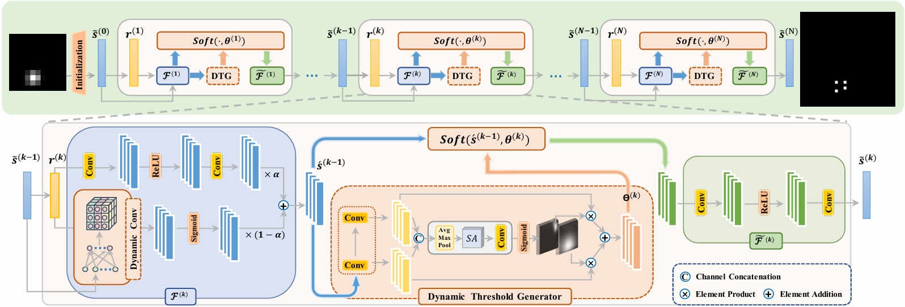
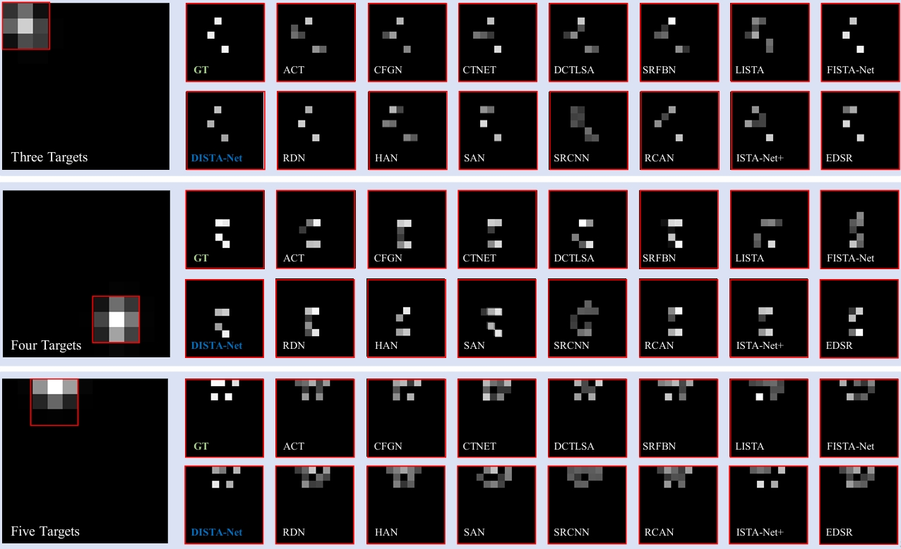

## 📘 Introduction
An open-source ecosystem for the unmixing of closely-spaced infrared small targets including:
- **CSIST-100K**, a publicly available benchmark dataset; 
- **CSO-mAP**, a custom evaluation metric for sub-pixel detection; 
- **GrokCSO**, an open-source toolkit featuring DISTA-Net and other models.
---

## Chinese Resources 🇨🇳 📚

- 📄 [Chinese Paper Translation: ](https://1drv.ms/b/c/698f69b8b2172561/ETFPfi9IRSVHrZczWRnZ11ABQJA0ZpXm5AyDF0y00eu4rA?e=gBPWnU) - OneDrive
- 📝 [Chinese Article Explanation](https://mp.weixin.qq.com/s/TCqu9ZSJRJXtyHNzKagOvA) - Wechat
- 📺 [Chinese Video Tutorial](https://www.bilibili.com/video/BV1d8tPzxESh/) - Bilibili

## 🗂 CSIST-100K Dataset
A synthetic dataset for multi-target sub-pixel resolution analysis under diffraction-limited conditions. Download: [Baidu Pan](https://pan.baidu.com/s/1nuedV5Okng8rgFWKy_sMoA?pwd=Grok) / [OneDrive](https://1drv.ms/f/c/698f69b8b2172561/EnQbsEb_rXpJlsNXinWyBbsBkhCsnSPM7UEgtczt7FDjmQ).
### Simulation Parameters

| Parameter           | Value/Range              |
|---------------------|--------------------------|
| Imaging Size        | 11×11 pixels             |
| $σ_{PSF}$           | 0.5 pixel                |
| Targets per Image   | 1–5 (random)             |
| Intensity Range     | 220–250 units (uniform)  |
| Spatial Constraints | Sub-pixel coordinates within a pixel + 0.52 Rayleigh unit separation |

## The network

---
Architecture of the proposed DISTA-Net. The overall framework consists of multiple cascaded stages. Each stage contains three main components: a dual-branch dynamic transform module ($\mathcal{F}^{(k)}$) for feature extraction, a dynamic threshold module ($\Theta^{(k)}$) for feature refinement, and an inverse transform module ($\tilde{\mathcal{F}}^{(k)}$) for reconstruction.


## Comparison with state-of-the-art methods

---

| Method    |   #P    | FLOPs  | CSO-mAP | AP-05 | AP-05 | AP-05 | AP-05 | AP-05 | PSNR  | SSIM  |
| :-------- | :-----: | :----: | :-----: | :---: | :---: | :---: | :---: | :---: | :---: | :---: |
| ISTA      |    -    |   -    |  7.46   | 0.01  | 0.31  | 2.39  | 9.46  | 25.14 |   -   |   -   |
| ACTNet    | 46.212M | 62.80G |  45.61  | 0.38  | 7.49  | 41.13 | 83.12 | 95.95 | 35.54 | 99.70 |
| CTNet     | 0.400M  | 2.756G |  45.11  | 0.38  | 7.53  | 40.39 | 82.11 | 95.14 | 35.15 | 99.70 |
| DCTLSA    | 0.865M  | 13.69G |  44.51  | 0.39  | 7.35  | 39.35 | 81.15 | 94.34 | 34.63 | 99.65 |
| EDSR      | 1.552M  | 12.04G |  45.32  | 0.33  | 7.07  | 40.58 | 83.24 | 95.41 | 35.37 | 99.71 |
| EGASR     | 2.897M  | 17.73G |  45.51  | 0.42  | 8.03  | 41.32 | 85.71 | 95.08 | 34.57 | 99.66 |
| FENet     | 0.682M  | 5.289G |  45.67  | 0.38  | 7.72  | 41.50 | 83.39 | 95.33 | 35.19 | 99.69 |
| RCAN      | 1.079M  | 8.243G |  45.87  | 0.42  | 7.96  | 41.81 | 83.61 | 95.57 | 35.21 | 99.69 |
| RDN       | 22.306M | 173.0G |  45.81  | 0.35  | 7.11  | 41.07 | 84.07 | 96.43 | 36.47 | 99.74 |
| SAN       | 4.442M  | 34.05G |  45.95  | 0.36  | 7.35  | 41.17 | 84.32 | 96.57 | 36.50 | 99.74 |
| SRCNN     | 0.019M  | 1.345G |  29.06  | 0.23  | 4.10  | 21.65 | 49.95 | 69.39 | 28.76 | 98.44 |
| SRFBN     | 0.373M  | 3.217G |  46.05  | 0.43  | 9.31  | 42.83 | 83.72 | 94.95 | 34.02 | 99.68 |
| HAN       | 64.342M | 495.0G |  45.70  | 0.39  | 7.46  | 40.90 | 83.61 | 96.17 | 35.27 | 99.71 |
| ISTA-Net  | 0.171M  | 12.77G |  45.16  | 0.41  | 7.71  | 40.57 | 82.58 | 94.53 | 33.92 | 99.68 |
| ISTA-Net+ | 0.337M  | 24.33G |  46.06  | 0.42  | 7.66  | 41.58 | 84.46 | 96.17 | 36.09 | 99.72 |
| LAMP      | 2.126M  | 0.278G |  14.22  | 0.05  | 1.11  | 7.31  | 21.56 | 41.06 | 27.83 | 96.89 |
| LIHT      | 21.10M  | 1.358G |  10.35  | 0.06  | 0.92  | 4.99  | 14.74 | 30.05 | 27.51 | 96.42 |
| LISTA     | 21.10M  | 1.358G |  30.13  | 0.25  | 4.13  | 22.29 | 51.18 | 72.82 | 29.89 | 99.12 |
| FISTA-Net | 0.074M  | 18.96G |  44.66  | 0.45  | 7.68  | 39.74 | 81.24 | 94.19 | 35.75 | 99.67 |
| TiLISTA   | 2.126M  | 0.278G |  14.95  | 0.06  | 1.23  | 7.72  | 22.50 | 46.23 | 27.70 | 97.40 |
| **ours**  | 2.179M  | 35.10G |  46.74  | 0.38  | 7.54  | 42.44 | 86.18 | 97.14 | 37.87 | 99.79 |


## 📘GrokCSO Instructions

### 🛠️Environment Preparation  
#### Installation
```shell
$ conda create --name grokcso python=3.9 
$ source activate grokcso
```
#### Step 1: Install PyTorch

```shell
# CUDA 12.1  
conda install pytorch==2.1.2 torchvision==0.16.2 torchaudio==2.1.2 pytorch-cuda=12.1 -c pytorch -c nvidia  
```
#### Step 2: Install OpenMMLab 2.x Codebases

```shell
$ pip install mmcv==2.1.0 -f https://download.openmmlab.com/mmcv/dist/cu121/torch2.1/index.html

$ pip install mmdet
```
#### Step 3: Install `grokcso`  

```shell
$ git clone https://github.com/GrokCV/GrokCSO.git
$ cd grokcso
$ python setup.py develop
```

### 📄Data preparation

#### 👀dataset directory format is as follows：

```shell
data/
├── initial_matrix/
│   ├── Q_3.mat                     # 3×3 sub-pixel division
│   ├── Q_5.mat                     # 5×5 sub-pixel division
│   └── Q_7.mat                     # 7×7 sub-pixel division
│
├── sampling_matrix/
│   ├── a_phi_0_3.mat              # 3x sub-pixel division
│   ├── a_phi_5.mat                # 5x sub-pixel division
│   └── a_phi_7.mat                # 7x sub-pixel division
│
└── cso_data/                       # CSO Dateset
    ├── train/                      # (80,000 samples)
    │   ├── Annotations/           
    │   │   ├── CSO_00000.xml      
    │   │   ├── ...
    │   │   └── CSO_79999.xml
    │   └── cso_img/               # Infrared image files
    │       ├── image_00000.png    
    │       ├── ...
    │       └── image_79999.png
    │
    ├── val/                        
    │   ├── Annotations/           # 80000-89999
    │   └── cso_img/
    │
    └── test/                       
        ├── Annotations/           # 90000-99999
        └── cso_img/
```
### 🚀Run Script

#### ✨Train a model：

```
# c = 3  
$ CUDA_VISIBLE_DEVICES=1 python tools/train.py --config configs/Agrok/dista.py  
  
# c = 5  
$ CUDA_VISIBLE_DEVICES=1 python tools/train.py --config configs/c_5/dista.py  
  
# c = 7  
$ CUDA_VISIBLE_DEVICES=1 python tools/train.py --config configs/c_7/dista.py   
```

#### ✨Test a model：

```
# c = 3  
$ CUDA_VISIBLE_DEVICES=1 python tools/test.py --config configs/fdist/dista.py --checkpoint /pth/dista/epoch_47.pth --work-dir work_dir/dista
  
# c = 5  
$ CUDA_VISIBLE_DEVICES=1 python tools/test.py --config configs/c_5/dista.py --checkpoint /pth/dista/c_5/epoch_105.pth --work-dir work_dir/dista/c_5
  
# c = 7  
$ CUDA_VISIBLE_DEVICES=1 python tools/test.py --config configs/c_7/dista.py --checkpoint /pth/dista/c_7/epoch_246.pth --work-dir work_dir/dista/c_7
```

### 🎁Citation
```
@article{han2025dista,
  title={DISTA-Net: Dynamic Closely-Spaced Infrared Small Target Unmixing},
  author={Han, Shengdong and Yang, Shangdong and Zhang, Xin and Li, Yuxuan and Li, Xiang and Yang, Jian and Cheng, Ming-Ming and Dai, Yimian},
  journal={arXiv preprint arXiv:2505.19148},
  year={2025}
}
```

