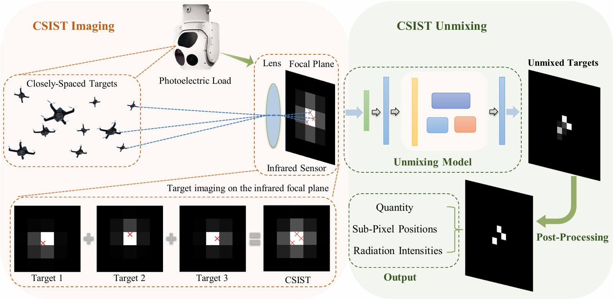
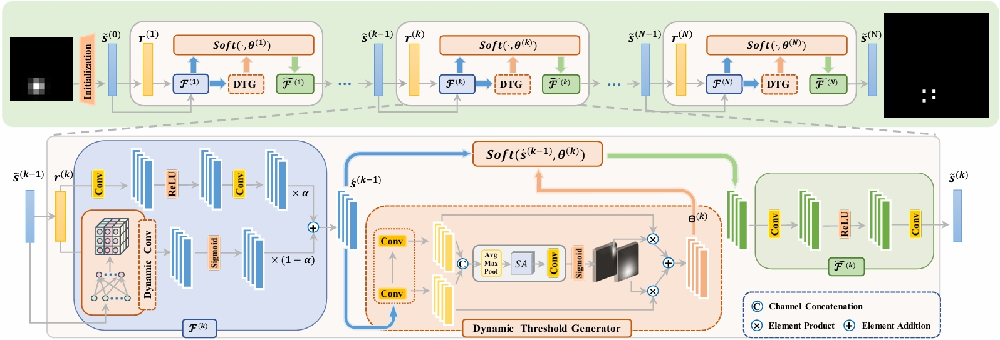
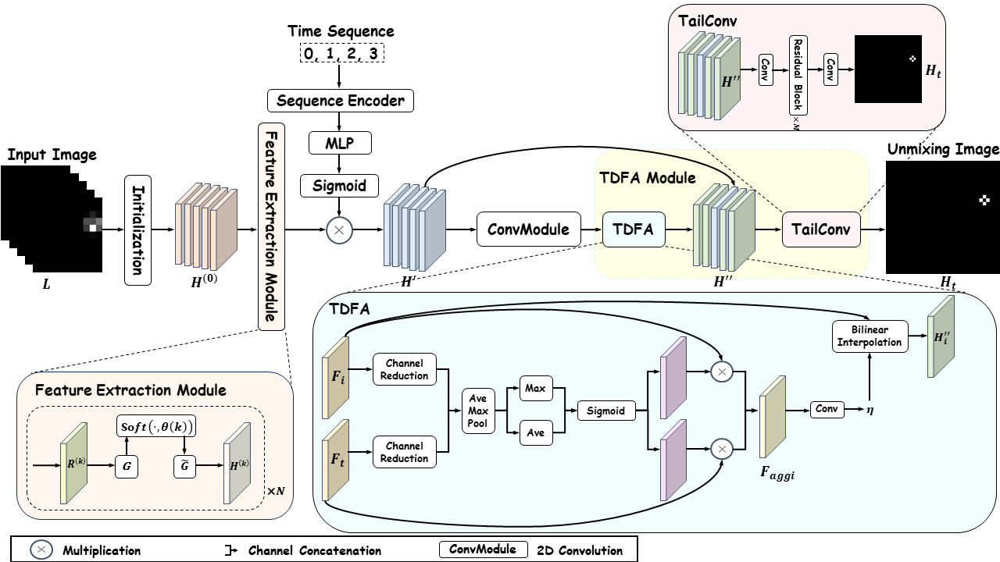
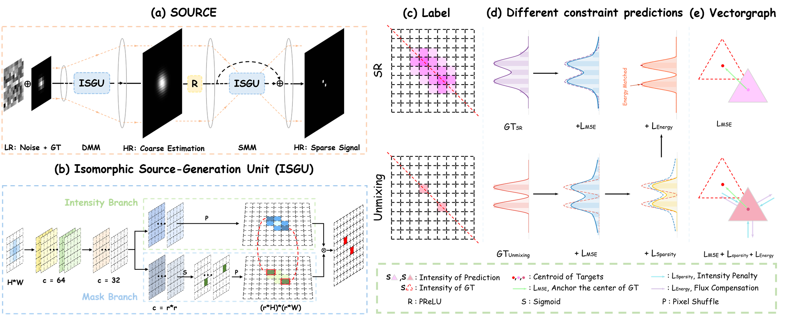
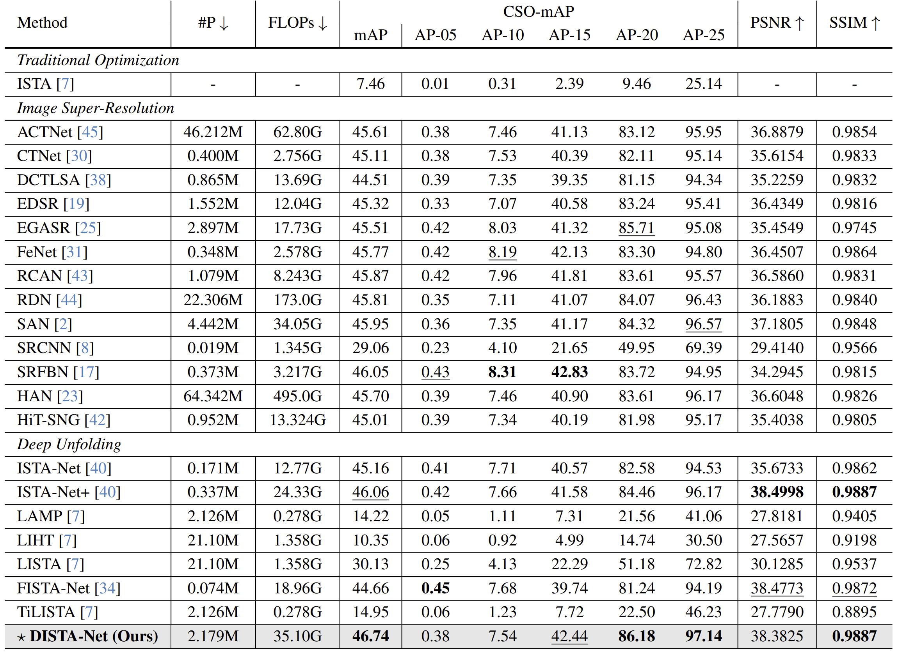
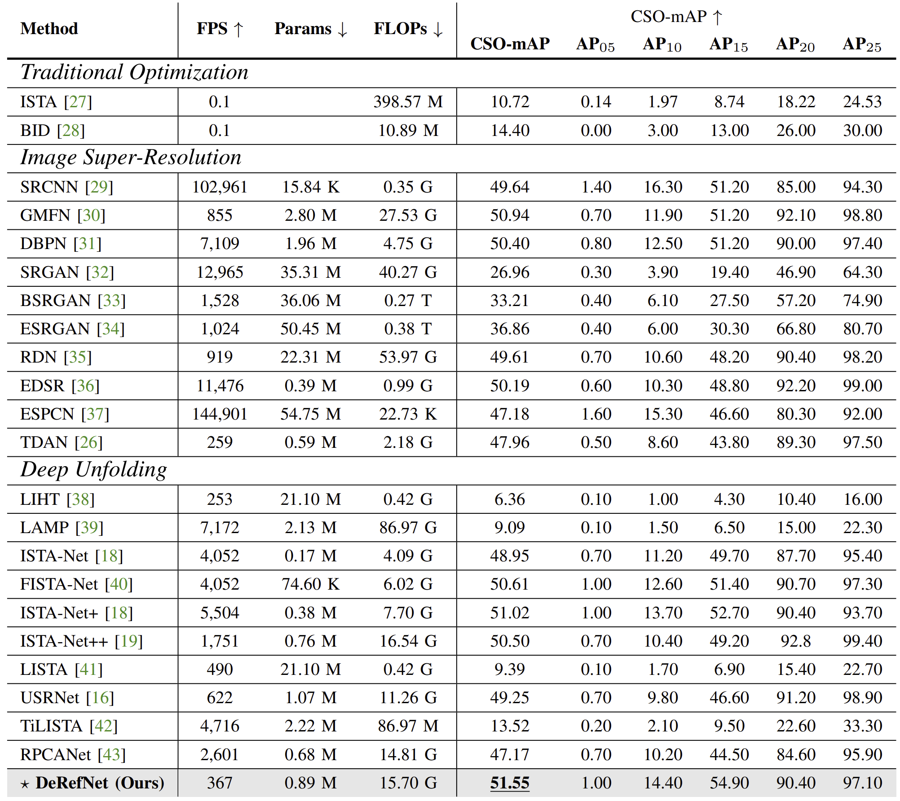
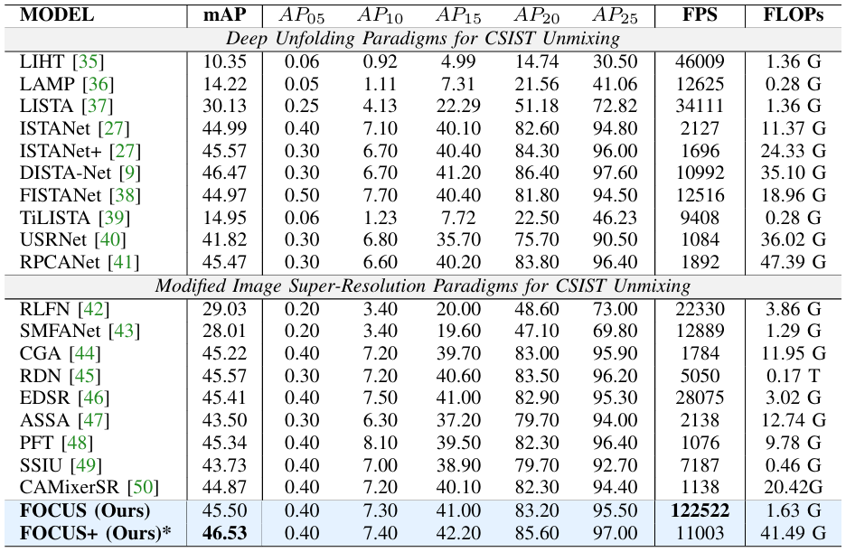

<table>
  <tr>
    <td width="9999" bgcolor="#F5F5F5" style="padding: 25px; border-radius: 12px; border: 1px solid #E0E0E0;">
      <div align="center">
        <h2 style="color: #333; margin-bottom: 15px;">🔬 Related Resources</h2>
        <p style="font-size: 1.1em; color: #666; margin-bottom: 20px;">
          These work are parts of our research on<br>
          <b>Closely-Spaced Infrared Small Target Unmixing</b><br>
      For a comprehensive collection of papers, datasets, and resources, visit:
        </p>
        <a href="https://github.com/GrokCV/Awesome-CSIST-Unmixing" 
           style="background: linear-gradient(45deg, #FF6B6B, #4ECDC4); 
                  color: white; 
                  padding: 12px 30px; 
                  border-radius: 25px; 
                  text-decoration: none; 
                  font-weight: bold;
                  font-size: 1.1em;">
          📚 View Awesome-CSIST-Unmixing
        </a>
      </div>
    </td>
  </tr>
</table>



This repository contains the official implementation of the following papers:

> DISTA-Net: Dynamic Closely-Spaced Infrared Small Target Unmixing<br/>
> Shengdong Han,
> Shangdong Yang,
> Yuxuan Li,
> Xin Zhang,
> Xiang Li,
> Jian Yang,
> Ming-Ming Cheng,
> Yimian Dai<br/>
> ICCV 2025.
>[Paper Link](https://arxiv.org/abs/2505.19148) |
>[中文论文翻译](https://1drv.ms/b/c/698f69b8b2172561/ETFPfi9IRSVHrZczWRnZ11ABQJA0ZpXm5AyDF0y00eu4rA?e=gBPWnU) |
>[博客解读](https://mp.weixin.qq.com/s/TCqu9ZSJRJXtyHNzKagOvA) |
>[视频讲解](https://www.bilibili.com/video/BV1d8tPzxESh/)

> SeqCSIST: Sequential Closely-Spaced Infrared Small Target Unmixing<br/>
> Ximeng Zhai,
> Bohan Xu,
> Yaohong Chen,
> Hao Wang,
> Kehua Guo,
> Yimian Dai<br/>
> IEEE TGRS 2025.
>[Paper Link](https://arxiv.org/pdf/2507.09556) |
>[博客解读](https://yimian.grokcv.ai/blog/seqcsist/) |
>[视频讲解](https://www.bilibili.com/video/BV1bbedz6E5b)


## 📘 Introduction
An open-source ecosystem for the unmixing of closely-spaced infrared small targets including:
- **CSIST-100K**, a publicly available benchmark dataset for single-frame CSIST Umixing; 
- **SeqCSIST**, a publicly available benchmark dataset specifically designed for multi-frame CSIST Umixing.

- **CSO-mAP**, a custom evaluation metric for sub-pixel detection; 
- **GrokCSO**, an open-source toolkit featuring DISTA-Net and other models.
---

## 🗂 Datasets
### CSIST-100K Dataset
A synthetic dataset for multi-target sub-pixel resolution analysis under diffraction-limited conditions. Download: [Baidu Pan](https://pan.baidu.com/s/1nuedV5Okng8rgFWKy_sMoA?pwd=Grok) / [OneDrive](https://1drv.ms/f/c/698f69b8b2172561/EnQbsEb_rXpJlsNXinWyBbsBkhCsnSPM7UEgtczt7FDjmQ).

| Parameter           | Value/Range              |
|---------------------|--------------------------|
| Imaging Size        | 11×11 pixels             |
| $σ_{PSF}$           | 0.5 pixel                |
| Targets per Image   | 1–5 (random)             |
| Intensity Range     | 220–250 units (uniform)  |
| Spatial Constraints | Sub-pixel coordinates within a pixel + 0.52 Rayleigh unit separation |
### SeqCSIST Dataset
A synthetic dataset specifically designed for multi-frame CSIST Unmixing, consisting of 100,000 frames organized into 5,000 random trajectories. Download: 
[Baidu Pan](https://pan.baidu.com/s/1_sxGh5oFQ8-3RpUUeMN2Mg?pwd=kxe9)


## 🏗 Networks

---
Architecture of the proposed DISTA-Net. The overall framework consists of multiple cascaded stages. Each stage contains three main components: a dual-branch dynamic transform module ($\mathcal{F}^{(k)}$) for feature extraction, a dynamic threshold module ($\Theta^{(k)}$) for feature refinement, and an inverse transform module ($\tilde{\mathcal{F}}^{(k)}$) for reconstruction.


---
Architecture of the proposed DeRefNet. The overall framework consists of three main modules: a sparsity-driven feature extraction module for effective CSIST feature extraction through nonlinear learnable and sparsifying transforms, a positional encoding module for temporal information enhancement to enable finer sub-pixel target localization, and a temporal deformable feature alignment (TDFA) module for dynamic reference-based refinement through multi-frame deformable alignment at the feature level.


---
Architecture of the proposed DeRefNet. The overall framework consists of three main modules: a sparsity-driven feature extraction module for effective CSIST feature extraction through nonlinear learnable and sparsifying transforms, a positional encoding module for temporal information enhancement to enable finer sub-pixel target localization, and a temporal deformable feature alignment (TDFA) module for dynamic reference-based refinement through multi-frame deformable alignment at the feature level.

## 📈 Comparison with state-of-the-art methods

---

---



## 📘GrokCSO Instructions

### 🛠️Environment Preparation  
#### Installation
```shell
$ conda create --name grokcso python=3.9 
$ source activate grokcso
```
#### Step 1: Install PyTorch

```shell
# CUDA 12.1  
conda install pytorch==2.1.2 torchvision==0.16.2 torchaudio==2.1.2 pytorch-cuda=12.1 -c pytorch -c nvidia  
```
#### Step 2: Install OpenMMLab 2.x Codebases

```shell
$ pip install -U openmim
$ pip install mmcv==2.1.0 -f https://download.openmmlab.com/mmcv/dist/cu121/torch2.1/index.html

$ pip install mmdet
```
#### Step 3: Install `grokcso`  

```shell
$ git clone https://github.com/GrokCV/GrokCSO.git
$ cd grokcso
$ python setup.py develop
```

### 🚀Run Script

#### ✨Train a model：

```
# c = 3  
$ CUDA_VISIBLE_DEVICES=1 python tools/train.py --config configs/Agrok/dista.py  
  
# c = 5  
$ CUDA_VISIBLE_DEVICES=1 python tools/train.py --config configs/c_5/dista.py  
  
# c = 7  
$ CUDA_VISIBLE_DEVICES=1 python tools/train.py --config configs/c_7/dista.py   
```

#### ✨Test a model：

```
# c = 3  
$ CUDA_VISIBLE_DEVICES=1 python tools/test.py --config configs/fdist/dista.py --checkpoint /pth/dista/epoch_47.pth --work-dir work_dir/dista
  
# c = 5  
$ CUDA_VISIBLE_DEVICES=1 python tools/test.py --config configs/c_5/dista.py --checkpoint /pth/dista/c_5/epoch_105.pth --work-dir work_dir/dista/c_5
  
# c = 7  
$ CUDA_VISIBLE_DEVICES=1 python tools/test.py --config configs/c_7/dista.py --checkpoint /pth/dista/c_7/epoch_246.pth --work-dir work_dir/dista/c_7
```

### 🎁Citation
```
@inproceedings{han2025dista,
  title={{DISTA-Net}: Dynamic Closely-Spaced Infrared Small Target Unmixing},
  author={Han, Shengdong and Yang, Shangdong and Li, Yuxuan and Zhang, Xin and Li, Xiang and Yang, Jian and Cheng, Ming-Ming and Dai, Yimian},
  booktitle={Proceedings of the IEEE/CVF International Conference on Computer Vision},
  pages={14655--14664},
  year={2025}
}

@article{zhai2025seqcsist,
  title={{SeqCSIST}: Sequential Closely-Spaced Infrared Small Target Unmixing},
  author={Zhai, Ximeng and Xu, Bohan and Chen, Yaohong and Wang, Hao and Guo, Kehua and Dai, Yimian},
  journal={IEEE Transactions on Geoscience and Remote Sensing},
  year={2025},
  publisher={IEEE}
}
```

